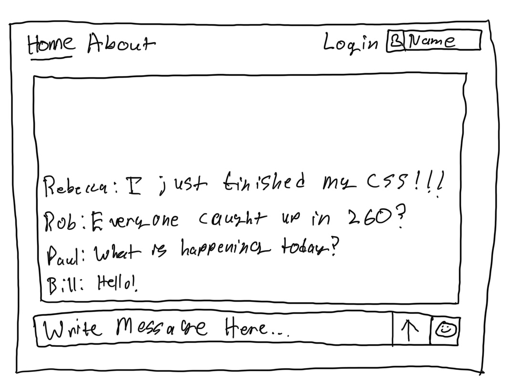

# Messaging Web Application

[My Notes](notes.md)

This web application utilizes a live messaging system to enable the user to chat with other users in real-time. 

## 🚀 Specification Deliverable

For this deliverable I did the following. I checked the box `[x]` and added a description for things I completed.

- [x] Proper use of Markdown
- [x] A concise and compelling elevator pitch
- [x] Description of key features
- [x] Description of how you will use each technology
- [x] One or more rough sketches of your application. Images must be embedded in this file using Markdown image references.

### Elevator pitch

Are you sick of not being able to message your friends on the fly? Wondering where the next awesome party is? In todays world, staying connected is more important than ever. My real-time messaging web application transforms how you can communicate by delivering an easy, fast and secure way to start seamless conversations with end-to-end encryption and an interface that you can access through any device. Join me in changing the way the world connects.

### Design

Here is a sequence diagram that shows how users would interact with the backend to send messages.

### Key features

- Secure Login via HTTPS (basic user authentication)
- Ability to send messages
    - Chat history is saved
- Users able to view other users sent messages
- Ability to use emojis in messages
- Ability to delete own messages

### Technologies

I am going to use the required technologies in the following ways.

- **HTML** - Uses correct HTML structure to layout website. There will be 3 HTML pages: One for login, one for chatting, and one for an about page.
- **CSS** - Uses good contrasting colors, will work accross different devices and aspect ratios. Ueses correct whitespace that looks neat and is easy to read.
- **React** - Provides login functionality, message display, sending messages, emoji selection, page selection, and the use of React for routing and other needed components.
- **Service** - Backend service with endpoints for:
    - login
    - sending messages
    - viewing messages
    - use [EmojiHub](https://github.com/cheatsnake/emojihub) to have emoji selections
- **DB/Login** - Stores users sent messages in database. Register and login users. User credentials stored in a secure database. Users cannot send messages until they have signed in.
- **WebSocket** - As users send messages, other users on the website can view their messages in real-time.

## 🚀 AWS deliverable

For this deliverable I did the following. I checked the box `[x]` and added a description for things I completed.

- [x] **Server deployed and accessible with custom domain name** - [My server link](https://jagarchat.com).

## 🚀 HTML deliverable

For this deliverable I did the following. I checked the box `[x]` and added a description for things I completed.

- [x] **HTML pages** - 3 different pages for website functionality: `index.html`, `chat.html`, and `about.html`
- [x] **Proper HTML element usage** - I spent a while figuring out how to structure my HTML. I spent quite a bit of time learning what each of the elements do to format my HTML correctly. Especially the `<textarea>` element since I had to figure out how to format it properly to look like a chatbox.
- [x] **Links** - Added links for all 3 pages. All pages link to each other.
- [x] **Text** - About page has text.
- [x] **3rd party API placeholder** - About page has placeholder for a 3rd party emojicon API (will also be used for emoji selection for the actual chat if the websocket doesn't have a selection).
- [x] **Images** - Added an image to the about page. Gives an insight into the author and what they like. 
- [x] **Login placeholder** - 2 forms for login on `index.html`, one for the username, and one for the password.
- [x] **DB data placeholder** - Message history stored in the textarea placeholder in `chat.html` as well as user login data.
- [x] **WebSocket placeholder** - Users can send messages in real-time in the placeholder text input area in `chat.html`.

## 🚀 CSS deliverable

For this deliverable I did the following. I checked the box `[x]` and added a description for things I completed.

- [x] **Header, footer, and main content body** - Added styling to the header, footer (bootstrap), and main body.
- [x] **Navigation elements** - Centered navigation menu, added bolding to elements that you are selected on as well as underline. Made text white as well.
- [x] **Responsive to window resizing** - Application is responsive to different window resizing and devices.
- [x] **Application elements** - Added styling and centered everything to make it more cohesive and easier on the eyes. Added shadowing to where it was applicable, used good spacing between different elements.
- [x] **Application text content** - All text uses same font, shadows on text elements as well.
- [x] **Application images** - Added styling to my image on my about page (sort of like a frame), also added a frame around the emoji 3rd party API placeholder.

## 🚀 React part 1: Routing deliverable

For this deliverable I did the following. I checked the box `[x]` and added a description for things I completed.

- [x] **Bundled using Vite** - Installed Vite and other necessary packages.
- [x] **Components** Login (Home), Chat, and about are all replaced with React components and placeholders are kept. All `class` properties were replaced with `className`.
    - **Login** - Both login buttons take you to the chat page.
    - **Chat** - I had to re-do some of the HTML and CSS, but it is mostly the same. Changed the textarea tag before to `htmlFor` for JSX. Placeholder for sending messages, using emojis, and chat history.
    - **About** - 3rd party emoji API placeholder is still there, all previous elements are where they are supposed to be.
    - **Not Found** - Added a not found page.
- [x] **Router** - Routing between login, chat, and about.

## 🚀 React part 2: Reactivity

For this deliverable I did the following. I checked the box `[x]` and added a description for things I completed.

- [ ] **All functionality implemented or mocked out** - I did not complete this part of the deliverable.
- [ ] **Hooks** - I did not complete this part of the deliverable.

## 🚀 Service deliverable

For this deliverable I did the following. I checked the box `[x]` and added a description for things I completed.

- [ ] **Node.js/Express HTTP service** - I did not complete this part of the deliverable.
- [ ] **Static middleware for frontend** - I did not complete this part of the deliverable.
- [ ] **Calls to third party endpoints** - I did not complete this part of the deliverable.
- [ ] **Backend service endpoints** - I did not complete this part of the deliverable.
- [ ] **Frontend calls service endpoints** - I did not complete this part of the deliverable.

## 🚀 DB/Login deliverable

For this deliverable I did the following. I checked the box `[x]` and added a description for things I completed.

- [ ] **User registration** - I did not complete this part of the deliverable.
- [ ] **User login and logout** - I did not complete this part of the deliverable.
- [ ] **Stores data in MongoDB** - I did not complete this part of the deliverable.
- [ ] **Stores credentials in MongoDB** - I did not complete this part of the deliverable.
- [ ] **Restricts functionality based on authentication** - I did not complete this part of the deliverable.

## 🚀 WebSocket deliverable

For this deliverable I did the following. I checked the box `[x]` and added a description for things I completed.

- [ ] **Backend listens for WebSocket connection** - I did not complete this part of the deliverable.
- [ ] **Frontend makes WebSocket connection** - I did not complete this part of the deliverable.
- [ ] **Data sent over WebSocket connection** - I did not complete this part of the deliverable.
- [ ] **WebSocket data displayed** - I did not complete this part of the deliverable.
- [ ] **Application is fully functional** - I did not complete this part of the deliverable.
